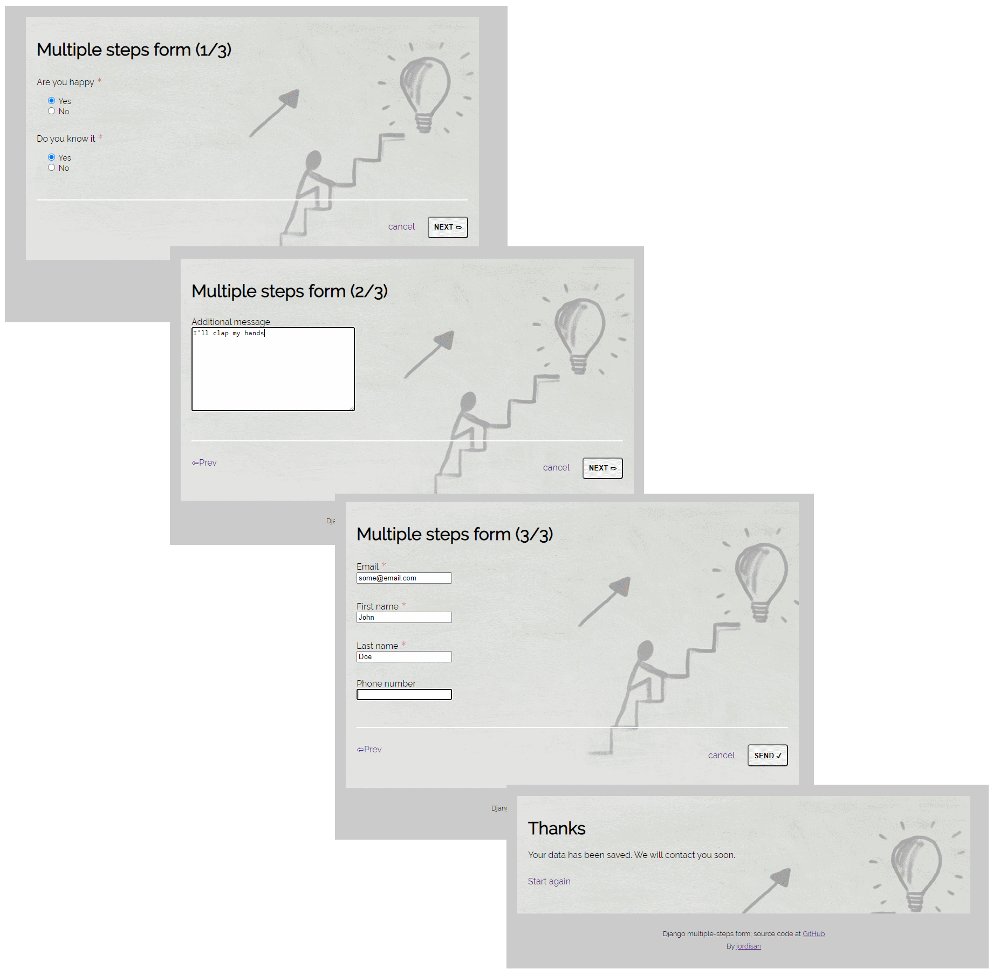

# Django multiple-steps form  live at https://django-multistep-form.herokuapp.com/

This is an example of a Django application (my first experiment) implementing a form splitted through multiple screens

## Code

* Global resources (for different projects) at [/general](./general): models, styles, ...
* Multistep form project at [/multistepform](/multistepform)
* REST api (using Django Rest framework) at [/api](./api); live api [deployed at Heroku](https://django-multistep-form.herokuapp.com/api/)
* Calls to get customer data using Vanilla JS: [JS module](general/assets/general.js) and [usage](/multistepform/assets/multistepform/form.js)
* Compile CSS using SASS [global styles](/general/assets/general.scss) and [form styles](/multistepform/assets/multistepform/form.scss)

## Details

* Temporary data are stored in session and stored to database in last step
* Root url redirects to first non-filled step
* Forms are automatically generated from models

### Devops

* Includes some tests for [models](/general/test_models.py), [forms](/multistepform/test_forms.py), API, ...
* [CI workflow (action) in GitHub](../../actions?query=workflow%3A%22Django+CI%22): build, tests
* Automatically [deployed to Heroku](https://django-multistep-form.herokuapp.com/)

## (I'd like) To-do

* Add info/placeholders for some fields
* Last step showing all data before submitting
* Multilanguage
* Use TypeScript
* Some more tests

